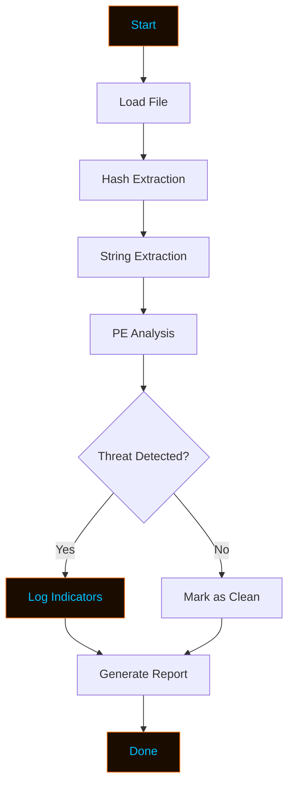
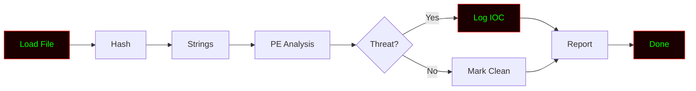

# VirusHawk
<!-- ═══════════════════════════════════════════════════════════════════════ -->
<!--                        VIRUSHAWK - README.md                            -->
<!--              Professional Security Research Documentation               -->
<!-- ═══════════════════════════════════════════════════════════════════════ -->

<div align="center">

<!-- Animated Header Banner -->


<!-- Typing Animation -->


<br>

<!-- Status Badges -->
<p>


</p>

<p>


</p>

<br>

<!-- Matrix Rain GIF -->


</div>

---

<div align="center">

```ascii
██╗   ██╗██╗██████╗ ██╗   ██╗███████╗██╗  ██╗ █████╗ ██╗    ██╗██╗  ██╗
██║   ██║██║██╔══██╗██║   ██║██╔════╝██║  ██║██╔══██╗██║    ██║██║ ██╔╝
██║   ██║██║██████╔╝██║   ██║███████╗███████║███████║██║ █╗ ██║█████╔╝ 
██║   ██║██║██╔══██╗██║   ██║╚════██║██╔══██║██╔══██║██║███╗██║██╔═██╗ 
╚██████╔╝██║██║  ██║╚██████╔╝███████║██║  ██║██║  ██║╚███╔███╔╝██║  ██╗
 ╚═════╝ ╚═╝╚═╝  ╚═╝ ╚═════╝ ╚══════╝╚═╝  ╚═╝╚═╝  ╚═╝ ╚══╝╚══╝ ╚═╝  ╚═╝

                    [ Analyze | Detect | Defend ]
```

</div>

---

## ⚠️ Legal Disclaimer

<div align="center">

```
╔══════════════════════════════════════════════════════════════════════╗
║                                                                      ║
║   VIRUSHAWK is a malware analysis and threat detection tool built    ║
║   for EDUCATIONAL and RESEARCH purposes only.                        ║
║                                                                      ║
║   ▸ Use ONLY on files you own or have permission to analyze.         ║
║   ▸ Analyzing malware you don't own is ILLEGAL.                      ║
║   ▸ Always follow ethical guidelines and local laws.                 ║
║   ▸ The author is NOT responsible for any misuse or damage.          ║
║                                                                      ║
║   Analyze responsibly. Learn ethically. Defend proactively.          ║
║                                                                      ║
╚══════════════════════════════════════════════════════════════════════╝
```

</div>

---

## 🎯 Overview

> **VIRUSHAWK** is a Python-based **malware analysis and threat detection framework** designed for **security researchers, malware analysts, and incident responders**. It provides a modular environment to inspect suspicious files, extract indicators, and identify potential threats — all in a controlled, ethical manner.

Whether you're analyzing a suspicious executable or studying malware behavior in a sandbox — VirusHawk gives you the **vision and precision** you need.

---

## ✨ Core Features

<div align="center">

| | Feature | Description |
|:---:|:---|:---|
| 🔍 | **File Analysis** | Inspects suspicious files efficiently |
| 🧬 | **Hash Extraction** | Generates MD5, SHA1, SHA256 |
| 🧪 | **String Extraction** | Pulls readable strings from binaries |
| 🛡️ | **VirusTotal Lookup** | Checks hashes against VT database |
| 📡 | **Network Indicators** | Extracts URLs, IPs, domains |
| 🧰 | **PE Analysis** | Examines PE headers and sections |
| ⚡ | **Multi-Threaded Engine** | Fast parallel analysis |
| 📊 | **Live Progress Bar** | Real-time terminal feedback |
| 📝 | **JSON Reports** | Structured, machine-readable output |
| 🎨 | **Hacker Terminal UI** | Orange + Blue aesthetic |

</div>

---

## 🚀 Installation

<div align="center">

</div>

### ⚡ One-Line Install

```bash
git clone https://github.com/anonmoty/VirusHawk.git && cd VirusHawk && pip install -r requirements.txt && python virushawk.py --help
```

### 🐧 Linux / 🍎 macOS

```bash
# Step 1 — Clone the repo
git clone https://github.com/anonmoty/VirusHawk.git

# Step 2 — Enter the directory
cd VirusHawk

# Step 3 — Install dependencies
pip install -r requirements.txt

# Step 4 — Start analyzing
python virushawk.py --help
```

### 🪟 Windows (PowerShell)

```powershell
git clone https://github.com/anonmoty/VirusHawk.git
cd VirusHawk
pip install -r requirements.txt
python virushawk.py --help
```

---

## 🎯 Usage

```bash
# Analyze a suspicious file
python virushawk.py --file suspicious.exe

# Hash only
python virushawk.py --file sample.bin --hash

# Extract strings
python virushawk.py --file sample.bin --strings

# Full analysis
python virushawk.py --file suspicious.exe --full --output reports/analysis.json

# VirusTotal lookup
python virushawk.py --file sample.bin --vt
```

### CLI Flags

| Flag | Description |
|:---|:---|
| `--file` | Path to suspicious file |
| `--hash` | Extract file hashes only |
| `--strings` | Extract readable strings |
| `--full` | Run full analysis |
| `--vt` | Lookup on VirusTotal |
| `--output` | Report output path |
| `--verbose` | Enable verbose logging |
| `--help` | Show help menu |

---

## 🧠 How It Works



1. **Load** — Reads the suspicious file
2. **Hash** — Generates MD5, SHA1, SHA256
3. **Strings** — Extracts readable text
4. **Analyze** — Examines PE headers and sections
5. **Detect** — Identifies suspicious indicators
6. **Report** — Displays structured findings

---

## 📁 Project Structure

```
VirusHawk/
├── virushawk.py              # Main entry point
├── core/
│   ├── __init__.py
│   ├── analyzer.py           # Analysis engine
│   ├── hasher.py             # Hash generator
│   ├── strings.py            # String extractor
│   └── reporter.py           # Report generator
├── payloads/                 # Sample files for testing
├── reports/                  # Generated reports
├── tests/                    # Unit tests
├── requirements.txt
├── LICENSE
└── README.md
```

---

## 📸 Demo

<div align="center">

```
╔═════════════════════════════════════════════════════════════╗
║  ██╗   ██╗██╗██████╗ ██╗   ██╗███████╗██╗  ██╗ █████╗ ██╗    ██╗██╗  ██╗ ║
║  ██║   ██║██║██╔══██╗██║   ██║██╔════╝██║  ██║██╔══██╗██║    ██║██║ ██╔╝ ║
║  ██║   ██║██║██████╔╝██║   ██║███████╗███████║███████║██║ █╗ ██║█████╔╝  ║
║  ██║   ██║██║██╔══██╗██║   ██║╚════██║██╔══██║██╔══██║██║███╗██║██╔═██╗  ║
║  ╚██████╔╝██║██║  ██║╚██████╔╝███████║██║  ██║██║  ██║╚███╔███╔╝██║  ██╗ ║
║   ╚═════╝ ╚═╝╚═╝  ╚═╝ ╚═════╝ ╚══════╝╚═╝  ╚═╝╚═╝  ╚═╝ ╚══╝╚══╝ ╚═╝  ╚═╝ ║
╚═════════════════════════════════════════════════════════════╝

[✓] File: suspicious.exe
[✓] Size: 245 KB
[✓] Type: PE32 Executable
[→] Analyzing...

[████████████████████████░░░░░░] 80% | Analyzing...
[✓] MD5:  d41d8cd98f00b204e9800998ecf8427e
[✓] SHA256: e3b0c44298fc1c149afbf4c8996fb924...
[!] Suspicious: Embedded URL found
[!] Suspicious: Base64 payload detected
[✓] Analysis complete in 3.21s
[✓] Report: reports/analysis_2024.json

        Stay Vigilant! 🛡️
```

</div>

---

## 🛠️ Requirements

```txt
requests>=2.28.0
colorama>=0.4.6
tqdm>=4.65.0
rich>=13.0.0
pefile>=2023.2.7
```

Install:

```bash
pip install -r requirements.txt
```

---

## 🎨 Hacker Terminal Theme

VirusHawk uses an **orange + electric blue** theme by default:

```python
THEME = {
    "primary":   "\033[38;5;208m",  # Neon Orange
    "secondary": "\033[38;5;39m",   # Electric Blue
    "accent":    "\033[38;5;214m",  # Amber
    "error":     "\033[38;5;196m",  # Red
    "warning":   "\033[38;5;220m",  # Yellow
    "info":      "\033[38;5;39m",   # Blue
    "reset":     "\033[0m",         # Reset
}
```

---

## 🔥 Power User Tips

### Combine with Other Tools

```bash
# VirusHawk + YARA
python virushawk.py --file sample.bin --full
yara -r rules/ sample.bin

# VirusHawk + VirusTotal API
python virushawk.py --file sample.bin --vt --output vt_report.json
```

### Sandbox Analysis

```bash
# Run in isolated VM
python virushawk.py --file malware.exe --full --output report.json
```

---

## 🐛 Security Research Workflow

VirusHawk fits perfectly into your analysis pipeline:

```
1. Sample Collection     →  MalwareBazaar / VT
2. Static Analysis       →  VirusHawk  ← you are here
3. Dynamic Analysis      →  Cuckoo / Any.Run
4. Rule Creation         →  YARA
5. Threat Intel Sharing  →  MISP
```

### Use Cases for Researchers

- 🔍 **Static analysis** of suspicious files
- 📜 **Indicator extraction** for threat intel
- 🗺️ **PE structure mapping** for reverse engineering
- 🧪 **AV evasion testing** in safe labs
- 📊 **Structured reports** for documentation

---

## 🗺️ Roadmap

- [x] File hash extraction
- [x] String extraction
- [x] PE header analysis
- [x] JSON report generation
- [x] Hacker terminal UI
- [ ] YARA rule integration
- [ ] VirusTotal API support
- [ ] Sandbox integration
- [ ] Docker image
- [ ] Web dashboard

---

## 🤝 Contributing

Contributions are welcome. Please follow these steps:

1. Fork the repository
2. Create your branch (`git checkout -b feature/amazing-feature`)
3. Commit your changes (`git commit -m 'Add amazing feature'`)
4. Push to the branch (`git push origin feature/amazing-feature`)
5. Open a Pull Request

---

## 📜 License

Distributed under the **MIT License**. See [`LICENSE`](LICENSE) for more information.

---

## 🙏 Credits

- **Author:** [@anonmoty](https://github.com/anonmoty)
- **Inspired by:** The malware research community
- **Built with:** Python, caffeine, and curiosity ☕

---

<div align="center">


<br><br>

### ⭐ If this tool helped you, drop a star!


</div>

<!-- ═══════════════════════════════════════════════════════════════════════ -->
<!--                        VIRUSHAWK - README.md                            -->
<!--              Professional Malware Analysis Documentation                -->
<!-- ═══════════════════════════════════════════════════════════════════════ -->

<div align="center">

# 🦅 VIRUSHAWK

### `Analyze • Detect • Defend`

**A Python-based malware analysis and threat detection framework for security researchers.**

[](https://github.com/anonmoty/VirusHawk)
[](https://python.org)
[](LICENSE)
[](https://github.com/anonmoty/VirusHawk)
[](https://github.com/anonmoty/VirusHawk)

</div>

---

```
████████████████████████████████████████████████████████████████████████
█                                                                      █
█   ██╗   ██╗██╗██████╗ ██╗   ██╗███████╗██╗  ██╗ █████╗ ██╗    ██╗██╗  ██╗
█   ██║   ██║██║██╔══██╗██║   ██║██╔════╝██║  ██║██╔══██╗██║    ██║██║ ██╔╝
█   ██║   ██║██║██████╔╝██║   ██║███████╗███████║███████║██║ █╗ ██║█████╔╝ 
█   ██║   ██║██║██╔══██╗██║   ██║╚════██║██╔══██║██╔══██║██║███╗██║██╔═██╗ 
█   ╚██████╔╝██║██║  ██║╚██████╔╝███████║██║  ██║██║  ██║╚███╔███╔╝██║  ██╗
█    ╚═════╝ ╚═╝╚═╝  ╚═╝ ╚═════╝ ╚══════╝╚═╝  ╚═╝╚═╝  ╚═╝ ╚══╝╚══╝ ╚═╝  ╚═╝
█                                                                      █
█                        [ Analyze | Detect | Defend ]                 █
█                                                                      █
████████████████████████████████████████████████████████████████████████
```

---

## ⚠️ Disclaimer

```
╔══════════════════════════════════════════════════════════════════════╗
║                                                                      ║
║   VIRUSHAWK is built for EDUCATIONAL and RESEARCH purposes only.     ║
║                                                                      ║
║   ▸ Analyze ONLY files you own or have permission to inspect.        ║
║   ▸ Unauthorized malware analysis is ILLEGAL.                        ║
║   ▸ Follow ethical guidelines and local laws at all times.           ║
║   ▸ The author is NOT responsible for any misuse.                    ║
║                                                                      ║
║   Analyze responsibly. Learn ethically. Defend proactively.          ║
║                                                                      ║
╚══════════════════════════════════════════════════════════════════════╝
```

---

## 🎯 What Is VirusHawk?

**VirusHawk** is a Python-based malware analysis and threat detection framework. It helps security researchers inspect suspicious files, extract indicators of compromise (IOCs), and identify potential threats — all inside a controlled, ethical environment.

Built for:
- 🔬 Malware analysts
- 🛡️ Incident responders
- 🎓 Security students
- 🧪 Threat hunters

---

## ✨ Features

```
┌─────────────────────────────────────────────────────────────────────┐
│  [01] 🔍 File Analysis        → Inspects suspicious files            │
│  [02] 🧬 Hash Extraction       → MD5, SHA1, SHA256                   │
│  [03] 🧪 String Extraction     → Pulls readable strings              │
│  [04] 🛡️ VirusTotal Lookup     → Checks hashes against VT            │
│  [05] 📡 Network Indicators    → Extracts URLs, IPs, domains         │
│  [06] 🧰 PE Analysis           → Examines PE headers and sections    │
│  [07] ⚡ Multi-Threaded        → Fast parallel analysis              │
│  [08] 📊 Progress Bar          → Real-time feedback                  │
│  [09] 📝 JSON Reports          → Machine-readable output             │
│  [10] 🎨 Terminal UI           → Clean hacker-style display          │
└─────────────────────────────────────────────────────────────────────┘
```

---

## 🚀 Installation

```bash
# Clone
git clone https://github.com/anonmoty/VirusHawk.git
cd VirusHawk

# Install dependencies
pip install -r requirements.txt

# Run
python virushawk.py --help
```

**One-liner:**

```bash
git clone https://github.com/anonmoty/VirusHawk.git && cd VirusHawk && pip install -r requirements.txt && python virushawk.py --help
```

---

## 🎯 Usage

```bash
# Analyze a file
python virushawk.py --file suspicious.exe

# Hash only
python virushawk.py --file sample.bin --hash

# Extract strings
python virushawk.py --file sample.bin --strings

# Full analysis
python virushawk.py --file suspicious.exe --full --output reports/analysis.json

# VirusTotal lookup
python virushawk.py --file sample.bin --vt
```

### CLI Flags

```
┌─────────────────────────────────────────────────────────────────────┐
│  --file      →  Path to suspicious file                             │
│  --hash      →  Extract file hashes only                            │
│  --strings   →  Extract readable strings                            │
│  --full      →  Run full analysis                                   │
│  --vt        →  Lookup on VirusTotal                                │
│  --output    →  Report output path                                  │
│  --verbose   →  Verbose logging                                     │
│  --help      →  Show help                                           │
└─────────────────────────────────────────────────────────────────────┘
```

---

## 🧠 How It Works



1. **Load** — Reads the file
2. **Hash** — Generates MD5, SHA1, SHA256
3. **Strings** — Extracts readable text
4. **Analyze** — Examines PE headers
5. **Detect** — Flags suspicious indicators
6. **Report** — Outputs structured findings

---

## 📁 Structure

```
VirusHawk/
├── virushawk.py
├── core/
│   ├── analyzer.py
│   ├── hasher.py
│   ├── strings.py
│   └── reporter.py
├── payloads/
├── reports/
├── tests/
├── requirements.txt
├── LICENSE
└── README.md
```

---

## 📸 Demo

```
██████████████████████████████████████████████████████████████████████
█                                                                    █
█   VIRUSHAWK v1.0.0                                                 █
█   ───────────────────────────────────────────────────────────      █
█                                                                    █
█   [✓] File: suspicious.exe                                         █
█   [✓] Size: 245 KB                                                 █
█   [✓] Type: PE32 Executable                                        █
█   [→] Analyzing...                                                 █
█                                                                    █
█   [████████████████████████░░░░░░] 80%                             █
█                                                                    █
█   [✓] MD5:    d41d8cd98f00b204e9800998ecf8427e                     █
█   [✓] SHA256: e3b0c44298fc1c149afbf4c8996fb924...                  █
█   [!] Suspicious: Embedded URL found                               █
█   [!] Suspicious: Base64 payload detected                          █
█   [✓] Analysis complete in 3.21s                                   █
█   [✓] Report: reports/analysis_2024.json                           █
█                                                                    █
█                        Stay Vigilant! 🛡️                           █
█                                                                    █
██████████████████████████████████████████████████████████████████████
```

---

## 🛠️ Requirements

```txt
requests>=2.28.0
colorama>=0.4.6
tqdm>=4.65.0
rich>=13.0.0
pefile>=2023.2.7
```

```bash
pip install -r requirements.txt
```

---

## 🎨 Terminal Theme

VirusHawk uses a **red + green** hacker palette:

```python
THEME = {
    "primary":   "\033[38;5;196m",  # Bright Red
    "secondary": "\033[38;5;46m",   # Matrix Green
    "accent":    "\033[38;5;214m",  # Amber
    "error":     "\033[38;5;196m",  # Red
    "warning":   "\033[38;5;220m",  # Yellow
    "info":      "\033[38;5;46m",   # Green
    "reset":     "\033[0m",
}
```

---

## 🔥 Power Tips

```bash
# VirusHawk + YARA
python virushawk.py --file sample.bin --full
yara -r rules/ sample.bin

# VirusHawk + VT API
python virushawk.py --file sample.bin --vt --output vt.json
```

---

## 🐛 Research Workflow

```
██████████████████████████████████████████████████████████████████████
█                                                                    █
█   [01] Sample Collection     →  MalwareBazaar / VT                 █
█   [02] Static Analysis       →  VirusHawk  ← you are here          █
█   [03] Dynamic Analysis      →  Cuckoo / Any.Run                   █
█   [04] Rule Creation         →  YARA                               █
█   [05] Threat Intel Sharing  →  MISP                               █
█                                                                    █
██████████████████████████████████████████████████████████████████████
```

### Use Cases

- 🔍 Static analysis of suspicious files
- 📜 IOC extraction for threat intel
- 🗺️ PE structure mapping
- 🧪 AV evasion testing in labs
- 📊 Structured reports

---

## 🗺️ Roadmap

```
┌─────────────────────────────────────────────────────────────────────┐
│  [x] Hash extraction                                                │
│  [x] String extraction                                              │
│  [x] PE header analysis                                             │
│  [x] JSON reports                                                   │
│  [x] Terminal UI                                                    │
│  [ ] YARA integration                                               │
│  [ ] VirusTotal API                                                 │
│  [ ] Sandbox integration                                            │
│  [ ] Docker image                                                   │
│  [ ] Web dashboard                                                  │
└─────────────────────────────────────────────────────────────────────┘
```

---

## 🤝 Contributing

1. Fork the repo
2. Create branch (`git checkout -b feature/amazing`)
3. Commit (`git commit -m 'Add amazing feature'`)
4. Push (`git push origin feature/amazing`)
5. Open Pull Request

---

## 📜 License

MIT License. See [`LICENSE`](LICENSE).

---

## 🙏 Credits

- **Author:** [@anonmoty](https://github.com/anonmoty)
- **Inspired by:** The malware research community
- **Built with:** Python, caffeine, and curiosity ☕

---

<div align="center">

```
██████████████████████████████████████████████████████████████████████
█                                                                    █
█          🦅  STAY VIGILANT.  ANALYZE ETHICALLY.  DEFEND.  🦅        █
█                                                                    █
█                  ⭐  If this tool helped you, star it!  ⭐           █
█                                                                    █
██████████████████████████████████████████████████████████████████████
```

</div>
